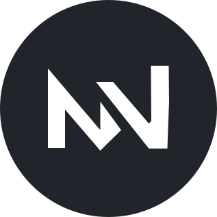

<!--README.md - Mew UI/UX Design-->

    

<h1 align="center">Mewa UI/UX Design</h1>

A place to share UI-related assets, resources, and discussions for Mewa

## About
This repo collects all image work used in [Mewa](https://www.mewatools.com), from the SVG files used to generate the icons to the web banners.

It's also used as a collaborative place for those interested in improving/modifying Mewa's UI/UX.

Topics in discussion:
- [Green and Blue colors](https://github.com/goulart81/mewa-artwork/discussions/2)
